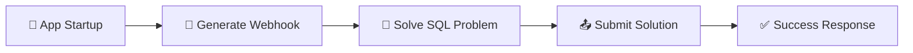

<div align="center">

# 🏥 Bajaj Finserv Health - Spring Boot Challenge

[](https://www.oracle.com/java/)
[](https://spring.io/projects/spring-boot)
[](https://maven.apache.org/)
[](LICENSE)

**Automated Spring Boot solution for Bajaj Finserv Health JAVA Qualifier 1**

[Download JAR](../../releases) • [View Challenge](BajajFinservHealth.md) 

</div>

---

## 📋 Table of Contents

- [Overview](#-overview)
- [Features](#-features)
- [Quick Start](#-quick-start)
- [SQL Solution](#-sql-solution)
- [Project Structure](#-project-structure)
- [Technologies](#-technologies)
- [API Documentation](#-api-documentation)
- [Testing](#-testing)
- [Submission](#-submission)

---

## 🎯 Overview

This Spring Boot application automatically solves the **Bajaj Finserv Health JAVA Qualifier 1** coding challenge. The application executes a complete workflow on startup without requiring any manual intervention.

### 🔄 Workflow



1. **Generate Webhook** - POST request to Bajaj API with credentials
2. **Solve SQL Query** - Find highest salary excluding 1st-of-month payments
3. **Submit Solution** - POST SQL query with JWT authentication
4. **Exit** - Application terminates after successful submission

---

## ✨ Features

- ✅ **Zero Manual Intervention** - Fully automated workflow using `CommandLineRunner`
- ✅ **No REST Controllers** - Executes on startup, no endpoints exposed
- ✅ **JWT Authentication** - Secure token-based API communication
- ✅ **Smart SQL Solution** - Complex multi-table join with date filtering
- ✅ **Error Handling** - Comprehensive logging and exception management
- ✅ **Production Ready** - Executable JAR with all dependencies bundled

---

## 🚀 Quick Start

### Prerequisites

- ☕ **Java 17+** ([Download](https://www.oracle.com/java/technologies/downloads/))
- 📦 **Maven 3.6+** ([Download](https://maven.apache.org/download.cgi))

### 📥 Installation

```bash
# Clone the repository
git clone https://github.com/ArshdKhan/BajajFinservHealth-Challenge.git
cd BajajFinservHealth-Challenge

# Build the project
mvn clean package

# Run the application
java -jar target/bajaj-finserv-health-challenge.jar
```

### ⚙️ Configuration

Update your credentials in `src/main/resources/application.properties`:

```properties
app.user.name=Your Full Name
app.user.regNo=Your Registration Number
app.user.email=your.email@example.com
```

### 📊 Expected Output

```
=== Starting Bajaj Finserv Health Challenge ===
Step 1: Generating webhook...
✓ Webhook generated successfully!
Step 2: Generating SQL solution...
✓ SQL Query generated
Step 3: Submitting solution...
✓ Solution submitted successfully
Response: {"success":true,"message":"Webhook processed successfully"}
=== Challenge completed successfully! ===
```

---

## 💡 SQL Solution

### Problem Statement

Find the **highest salary** credited to an employee **excluding transactions on the 1st of any month**, along with employee name, age at payment date, and department.

### Solution Query

```sql
SELECT 
    p.AMOUNT AS SALARY, 
    CONCAT(e.FIRST_NAME, ' ', e.LAST_NAME) AS NAME, 
    TIMESTAMPDIFF(YEAR, e.DOB, p.PAYMENT_TIME) AS AGE, 
    d.DEPARTMENT_NAME 
FROM PAYMENTS p 
INNER JOIN EMPLOYEE e ON p.EMP_ID = e.EMP_ID 
INNER JOIN DEPARTMENT d ON e.DEPARTMENT = d.DEPARTMENT_ID 
WHERE DAY(p.PAYMENT_TIME) != 1 
ORDER BY p.AMOUNT DESC 
LIMIT 1
```

### 🎓 Key Components

| Component | Description |
|-----------|-------------|
| **Filter** | `WHERE DAY(p.PAYMENT_TIME) != 1` - Excludes all 1st-of-month payments |
| **Age Calculation** | `TIMESTAMPDIFF(YEAR, e.DOB, p.PAYMENT_TIME)` - Age at payment date |
| **Joins** | PAYMENTS → EMPLOYEE → DEPARTMENT (3-table join) |
| **Sorting** | `ORDER BY p.AMOUNT DESC LIMIT 1` - Highest salary only |

### 📈 Expected Result

| SALARY | NAME | AGE | DEPARTMENT_NAME |
|--------|------|-----|-----------------|
| 74998.00 | Emily Brown | 32 | Sales |

> 💰 Payment ID 16 on 2025-03-02 to Emily Brown (DOB: 1992-11-30)

---

## 📁 Project Structure

```
BajajFinservHealth-Challenge/
├── 📄 pom.xml                          # Maven configuration
├── 📄 README.md                        # This file
├── 📄 BajajFinservHealth.md           # Challenge description
├── 📁 src/
│   └── 📁 main/
│       ├── 📁 java/com/bajajfinserv/health/
│       │   ├── 🎯 BajajFinservHealthApplication.java    # Main entry point
│       │   ├── 📁 dto/
│       │   │   ├── WebhookRequest.java                  # Request DTO
│       │   │   ├── WebhookResponse.java                 # Response DTO
│       │   │   └── SolutionRequest.java                 # Solution DTO
│       │   ├── 📁 service/
│       │   │   ├── ChallengeService.java                # API communication
│       │   │   └── SqlQueryService.java                 # SQL solution logic
│       │   └── 📁 runner/
│       │       └── ChallengeRunner.java                 # Startup workflow
│       └── 📁 resources/
│           └── application.properties                    # Configuration
└── 📁 target/
    └── bajaj-finserv-health-challenge.jar               # Executable JAR
```

---

## 🛠️ Technologies

<table>
<tr>
<td align="center" width="25%">
<br />
<b>Spring Boot</b><br />
v3.2.0
</td>
<td align="center" width="25%">
<br />
<b>Java</b><br />
v17
</td>
<td align="center" width="25%">
<br />
<b>Maven</b><br />
v3.6+
</td>
<td align="center" width="25%">
<br />
<b>REST API</b><br />
RestTemplate
</td>
</tr>
</table>

---

## 📡 API Documentation

### 1️⃣ Generate Webhook

```http
POST https://bfhldevapigw.healthrx.co.in/hiring/generateWebhook/JAVA
Content-Type: application/json

{
  "name": "A Arshad Khan",
  "regNo": "PES2UG22CS001",
  "email": "arshadkhan672004@gmail.com"
}
```

**Response:**
```json
{
  "webhook": "https://bfhldevapigw.healthrx.co.in/hiring/testWebhook/JAVA",
  "accessToken": "eyJhbGciOiJIUzI1NiIsInR5cCI6IkpXVCJ9..."
}
```

### 2️⃣ Submit Solution

```http
POST https://bfhldevapigw.healthrx.co.in/hiring/testWebhook/JAVA
Authorization: <accessToken>
Content-Type: application/json

{
  "finalQuery": "SELECT p.AMOUNT AS SALARY..."
}
```

**Response:**
```json
{
  "success": true,
  "message": "Webhook processed successfully"
}
```

---

## 🧪 Testing

### Manual Testing with Postman

1. **Import Collection** - Use the API documentation above
2. **Test Webhook Generation** - Verify credentials and token generation
3. **Test Solution Submission** - Confirm SQL query acceptance

### Automated Testing

```bash
# Run the application
java -jar target/bajaj-finserv-health-challenge.jar

# Check logs for success message
# Expected: "Challenge completed successfully!"
```

## 👨‍💻 Author

**A Arshad Khan**
- Registration Number (SRN): PES2UG22CS001
- Email: arshadkhan672004@gmail.com

---

## 📄 License

This project is created for the Bajaj Finserv Health coding challenge.

---

<div align="center">

Made with ❤️ for Bajaj Finserv Health Challenge

⭐ Star this repo if you found it helpful!

</div>
